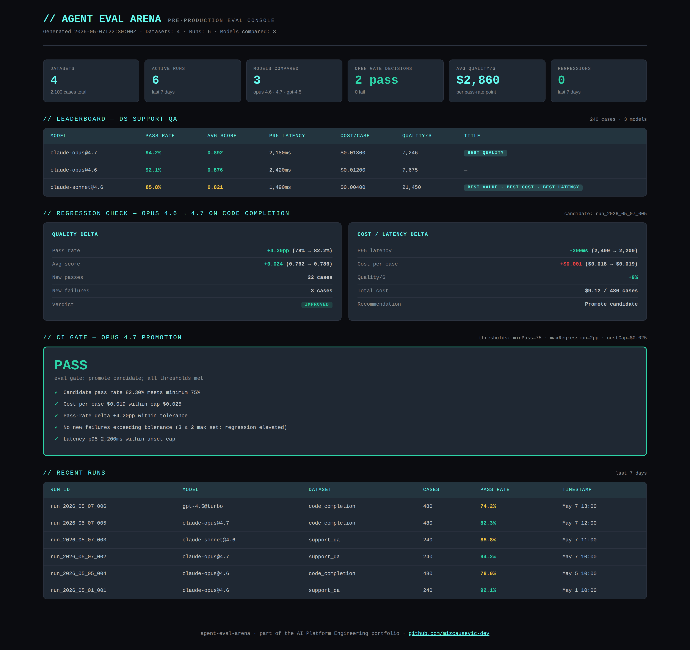

# Agent Eval Arena

[](https://github.com/mizcausevic-dev/agent-eval-arena/actions/workflows/ci.yml)
[](https://nodejs.org)
[](https://www.typescriptlang.org)
[](LICENSE)

Evaluation harness for **AI agents and LLMs** — golden datasets, multi-scorer execution, regression detection across model versions, cost-quality leaderboards, and CI-gating decisions for model promotion. The pre-production half of the loop that `agentobserve` closes after deploy.

> Recruiter takeaway:
>
> *"This person is the engineer who actually wires LLM eval into the release pipeline. Pass-rate gates, cost caps, latency caps, and regression checks — all of it as testable backend logic that can fail a build before a customer sees a regression."*

## Why This Exists

Most AI teams either ship without eval (and find regressions in production) or have a Jupyter notebook that someone runs occasionally (which nobody trusts in CI). The middle ground is a service: a real eval harness with versioned datasets, scoring engines, regression comparison, and a gate that returns `pass` / `fail` so CI can block bad promotions.

This repo is that service. It ships with five scoring engines (exact match, fuzzy, token overlap, rubric-based aggregation), a regression detector that diffs two runs, a leaderboard that ranks models on quality / cost / latency / value, and a CI gate that returns a single decision your pipeline can branch on.

## Where This Sits in the Portfolio

| Repo | Surface | Question it answers |
|---|---|---|
| [`mcp-sentinel`](https://github.com/mizcausevic-dev/mcp-sentinel) | Tool calls | *What MCP tools are exposed and how risky?* |
| [`rag-sentinel`](https://github.com/mizcausevic-dev/rag-sentinel) | Retrieval | *What's in the vector store and how trustworthy?* |
| [`agent-codex`](https://github.com/mizcausevic-dev/agent-codex) | Decisions | *Under what policies are decisions allowed?* |
| **`agent-eval-arena`** | **Pre-production** | ***Should this model promotion ship?*** |
| [`agentobserve`](https://github.com/mizcausevic-dev/agentobserve) | Runtime | *What did agents actually do?* |
| [`kinetic-flightdeck`](https://github.com/mizcausevic-dev/kinetic-flightdeck) | Operator | *Are we OK right now? Who do I call?* |

## Project Overview

| Attribute | Detail |
|---|---|
| Runtime | Node.js + TypeScript |
| Framework | Express 5 |
| Domain | LLM/agent evaluation and CI gating |
| Scoring | Exact match · Fuzzy (Levenshtein) · Token overlap · Rubric (multi-criterion) |
| Analysis | Regression detection · Multi-model leaderboards · Quality-per-dollar |
| CI Integration | Single-call gate decision: `pass` / `fail` |

## Five Capabilities

### 1. Text-Match Scorers

Three deterministic scorers for known-output evaluation:

| Scorer | When to use |
|---|---|
| `exactMatch` | Classification, extraction, slot-filling — answer must equal expected |
| `fuzzyMatch` (Levenshtein) | Tolerates typos and minor formatting variance |
| `tokenOverlap` (Jaccard) | Bag-of-words match for paraphrasing tolerance |

All three handle case sensitivity, whitespace normalization, and trim independently.

### 2. Rubric-Based Scoring

For open-ended outputs scored against multi-criterion rubrics. Each criterion has a weight; per-case results are `pass`, `partial`, or `fail`. The aggregator returns weighted score, criteria pass/fail breakdown, and worst-failure highlight (highest-weight criterion that failed).

Rollup across many cases yields per-criterion pass rates — surfacing systemic weaknesses ("model passes accuracy 92% but fails safety 4% of the time").

### 3. Regression Detection

Compares two eval runs (baseline vs candidate) and produces:

- Pass-rate delta (percentage points)
- Average score delta
- Latency p95 delta
- Cost-per-case delta
- New failures (cases that passed in baseline, fail in candidate)
- New passes (cases that failed in baseline, pass in candidate)
- Verdict: `improved` · `no-change` · `regression` · `severe-regression`

Severe-regression triggers when pass rate drops ≥ 5pp OR new failures exceed 5% of dataset.

### 4. Multi-Model Leaderboard

For a given dataset with multiple model runs, the leaderboard ranks models on four axes:

| Axis | Definition |
|---|---|
| `bestQuality` | Highest pass rate |
| `bestCost` | Lowest avg cost per case |
| `bestLatency` | Lowest avg latency |
| `bestValue` | Best quality-per-dollar (pass rate ÷ cost per case) |

The fourth metric is what CFOs look at — and it usually doesn't pick the same model as `bestQuality`.

### 5. CI Gate

The integration point. Wire `POST /api/eval/gate` into your CI/CD pipeline. Pass thresholds (or accept defaults), pass the candidate run (and optional baseline), receive a single `pass` / `fail` decision plus reasons.

```json
{
  "minPassRate": 80,
  "maxRegressionPp": 2,
  "maxNewFailures": 2,
  "maxLatencyP95Ms": 0,
  "maxCostPerCaseUsd": 0
}
```

Set `maxLatencyP95Ms` or `maxCostPerCaseUsd` to non-zero to enforce hard caps in addition to relative regression checks.

## API Endpoints

### Scoring

| Method | Endpoint | Purpose |
|---|---|---|
| POST | `/api/score/exact-match` | Exact match with normalization options |
| POST | `/api/score/fuzzy-match` | Levenshtein-based similarity |
| POST | `/api/score/token-overlap` | Jaccard bag-of-words match |
| POST | `/api/score/rubric` | Multi-criterion rubric aggregation |

### Evaluation

| Method | Endpoint | Purpose |
|---|---|---|
| POST | `/api/eval/compare` | Compare two runs; return regression verdict |
| POST | `/api/eval/gate` | CI gate decision with thresholds |

### Read

| Method | Endpoint | Purpose |
|---|---|---|
| GET | `/health` | Service status |
| GET | `/api/datasets` | List eval datasets |
| GET | `/api/datasets/:id` | Single dataset |
| GET | `/api/datasets/:id/runs` | Runs for a dataset |
| GET | `/api/datasets/:id/leaderboard` | Multi-model rankings on dataset |
| GET | `/api/runs` | All runs |
| GET | `/api/runs/:id` | Single run with per-case results |

## Sample: CI Gate Decision

```json
POST /api/eval/gate
{
  "candidate": {
    "runId": "run_2026_05_07_005",
    "modelId": "claude-opus",
    "modelVersion": "4.7",
    "datasetId": "ds_code_completion",
    "timestamp": "2026-05-07T12:00:00Z",
    "cases": [ ... 480 cases ... ]
  },
  "baseline": {
    "runId": "run_2026_05_05_004",
    "modelId": "claude-opus",
    "modelVersion": "4.6",
    "datasetId": "ds_code_completion",
    "timestamp": "2026-05-05T10:00:00Z",
    "cases": [ ... 480 cases ... ]
  },
  "thresholds": {
    "minPassRate": 75,
    "maxRegressionPp": 2,
    "maxCostPerCaseUsd": 0.025
  }
}
```

```json
{
  "decision": "pass",
  "reasons": [],
  "passingChecks": [
    "Candidate pass rate 82.30% meets minimum.",
    "Cost per case $0.01900 within cap.",
    "Pass-rate delta +4.20pp within tolerance.",
    "No new failures vs baseline."
  ],
  "recommendedAction": "Promote candidate; eval gate passed."
}
```

## Operator Console Preview



## Getting Started

### Prerequisites

- Node.js 20+
- npm

### Setup

```bash
git clone https://github.com/mizcausevic-dev/agent-eval-arena.git
cd agent-eval-arena
npm install
npm run dev
```

Visit:

- `http://localhost:3000/health`
- `http://localhost:3000/api/datasets`
- `http://localhost:3000/api/datasets/ds_support_qa/leaderboard`

### Run Tests

```bash
npm test
```

25 unit tests across text-match scorers, rubric aggregation, regression detection, leaderboard ranking, and CI gate decision logic.

## What This Demonstrates

- LLM/agent eval translated into testable, deterministic backend logic — no judge LLMs required for the harness layer
- Cost and latency thresholds as first-class CI signals (most teams gate only on quality, miss the FinOps regression)
- Regression detection as a structural diff, not a manual notebook ritual
- Quality-per-dollar as a buyer-facing metric (the one CFOs actually want)
- Strict-mode TypeScript with full test coverage; CI matrix on Node 20 + 22

## Future Enhancements

- LLM-as-judge integration for rubric per-criterion scoring
- Dataset versioning with hash-pinning for reproducibility
- Real-time eval streaming via SSE
- Webhook-driven CI gate (`POST` from GitHub Actions, return decision)
- Multi-tenant control plane for managed-service deployment
- Integration with `agentobserve` for production-vs-eval drift detection

## Tech Stack

- Node.js, TypeScript, Express, Zod
- Helmet, CORS, Morgan
- Node test runner

## Portfolio Links

- [LinkedIn](https://www.linkedin.com/in/mizcausevic/)
- [Skills Page](https://mizcausevic.com/skills)
- [Medium](https://medium.com/@mizcausevic)
- [GitHub](https://github.com/mizcausevic-dev)

Part of [mizcausevic-dev's GitHub portfolio](https://github.com/mizcausevic-dev) — AI Platform Engineering doctrine.

---

**Connect:** [LinkedIn](https://www.linkedin.com/in/mirzacausevic/) · [Kinetic Gain](https://kineticgain.com) · [Medium](https://medium.com/@mizcausevic/) · [Skills](https://mizcausevic.com/skills/)
